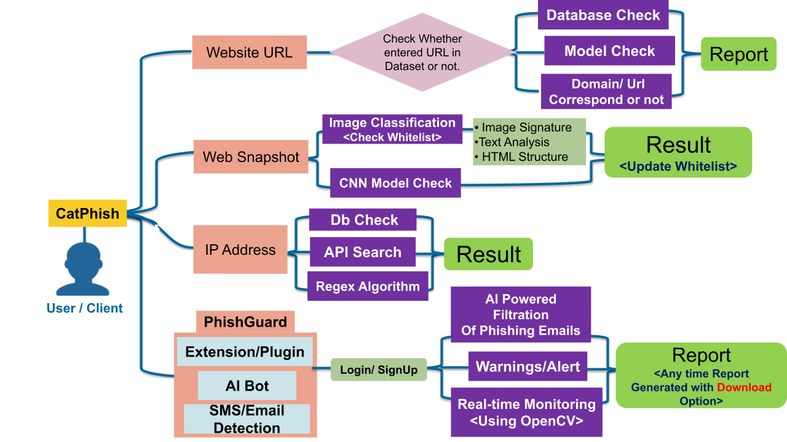

# <h1><B>catPhish</b></h1><h6><i>an embedded & robust Software to Eliminate Phishing.</i></h6>
live @ - https://phishing-website-detection-production.up.railway.app/api/detect2/
<h2>Problem Statement</h2>

<h5>Title</h5>
Create an intelligent system using AI/ML to detect phishing domains which imitate look and feel of genuine domains
<h5>Description</h5>

Phishing attack is the most prevalent attack technique to compromise users worldwide. Phishing links/websites are shared through number of mediums like email, SMS etc. to target users. These domains are at times host user login page that imitates the genuine target websites. Login attempts on such pages can lead to compromise of user credentials and may also download malicious payload in user computers. The objective of the problem is to identify such phishing domains from the newly registered websites based on open source databases (Example WHOIS Database). Such databases provide list of newly registered domains. The tool should be automated and harness power of AI/ML to identify phishing domains from genuine domains. It may use the following techniques: (a) Backend code / content similarity in web pages. (b) Web page image analysis (i.e. analysis between genuine and phishing site web page images; more the similarity better is the probability score of being a lookalike phishing site). The evaluation would be based on the tool’s ability with regard to the following: (e) Probability scores of phishing domains on how close they are to the genuine domain. (f) Ability to detect new phishing domains in reasonable time. (g) Ease of use and flexibility in output formats.

Organization 	&nbsp;&nbsp;&nbsp;&nbsp;&nbsp;&nbsp;National Technical Research Organisation,(NTRO)

Category	&nbsp;&nbsp;&nbsp;&nbsp;&nbsp;&nbsp;<b>Software</b>

Domain &nbsp;&nbsp;&nbsp;&nbsp;&nbsp;&nbsp;<b>Blockchain & Cybersecurity</b>

 
<h2>Solution</h2>

We are dedicated to crafting a robust solution that effectively shields our users from the pervasive threat of phishing. Our comprehensive approach revolves around the development of cutting-edge Phishing detection and avoidance software, accessible through various platforms such as a Cross-Platform Mobile App, Responsive Web App, and Browser Extension. This innovative suite of tools aims to provide a multifaceted defense against phishing attacks, ensuring the security of user data.

Our journey toward enhanced security begins with a meticulous examination of the sender's domain. Leveraging the power of DMARC (Domain-based Message Authentication), we ascertain the legitimacy of the sender's domain. This initial step acts as a crucial gatekeeper, allowing only authenticated domains to pass through and communicate with users.

However, our commitment to safeguarding users goes beyond domain authentication. We recognize that phishing attacks often manifest through deceptive website addresses embedded in emails or local messages. To counter this, we harness the capabilities of advanced Machine Learning Algorithms, specifically Light GBM and Random Forest. These algorithms undertake a comprehensive analysis of website addresses, factoring in a wealth of data, including WHOIS information, PhishTank Database checks, SSL (Secure Sockets Layer) Certificate validation, and other relevant thresholds. The result? A finely tuned assessment of the likelihood that a website is associated with phishing activities.

Continuing our proactive stance against phishing, we maintain an extensive database of known phishing domains. The algorithms at the core of our solution meticulously cross-reference the website domain in received messages with this database. Any matches trigger an immediate alert, effectively warning users of potential dangers lurking in their digital interactions.

Empowering users is central to our philosophy. We have integrated a range of user verification tools into our solution, allowing individuals to actively participate in the battle against phishing. By enabling users to verify the legitimacy of websites through comparisons of Web-Images, HTML code, and text, collected via meticulous Webscraping, we create a collaborative network that enhances the solution's accuracy and effectiveness.

For those unfortunate instances where users inadvertently access phishing websites, we have engineered a guardian in the form of our PhishguardBOT. This intelligent entity takes swift action, severing the connection between the compromised website and our central database. Simultaneously, it securely retains vital user interaction information, invaluable for potential investigations or remediation efforts.

Looking to the horizon, we are embarking on the development of a revolutionary Blockchain-based Authentication system. This cutting-edge solution will house a registry of legitimate senders on our secure Blockchain network. Harnessing the immutable power of blockchain technology, we will authenticate sender domains with unmatched precision and efficiency. This groundbreaking approach significantly reduces the vulnerability to successful phishing attacks.

In summary, our holistic anti-phishing solution seamlessly integrates domain authentication, state-of-the-art machine learning algorithms, user verification tools, and a pioneering blockchain-based authentication system. Across multiple platforms, we empower users to navigate the digital realm with unwavering confidence, assured that their valuable data remains beyond the reach of malicious actors. Our unwavering commitment to innovation ensures that we stay ahead of evolving threats, delivering a safer online experience for all.

 
<h2>Internal Working Flowchart</h2>

<h2>Stack Used </h2>

<h1>Table For Accuracy & Pecision Comparison Based on Research Paper's For PHISHING DETECTION</h1>

Accuracy of various ML model used for Phishing detection

<table>
  <tr>
    <th></th>
    <th>Algorithm</th>
    <th>Accuracy</th>
    <th>Precision</th>
    <th>Accuracy_max_ft_3000</th>
   
  </tr>
  <tr>
     <td>0</td>
     <td>KN</td>
     <td>  0.905222 </td>
     <td> 1.000000  </td>
     <td>  0.905222 </td>
  </tr>
   <tr>
     <td>1</td>
     <td>  NB </td>
     <td>  0.978723 </td>
     <td>  1.000000 </td>
     <td> 0.971954</td>
     
  </tr>
   <tr>
     <td>2</td>
     <td> ETC	</td>
     <td>  0.979691  </td>
     <td> 0.991453</td>
     <td>0.979691</td>
   
  </tr>
   <tr>
     <td>3</td>
     <td> RF</td>
     <td> 0.975822 </td>
     <td>0.990826</td>
     <td>0.975822  </td>
    
  </tr>
  <tr>
     <td>4</td>
     <td> SVC</td>
     <td> 0.971954</td>
     <td>  0.974138</td>
     <td> 0.974855</td>
    
  </tr>
   <tr>
     <td>5</td>
     <td> AdaBoost</td>
     <td>0.961315</td>
     <td>0.954128 </td>
     <td> 0.961315</td>
    
  </tr>
   <tr>
     <td>6</td>
     <td> xgb </td>
     <td> 0.968085 </td>
     <td>0.950413</td>
     <td> 0.968085</td>
    
  </tr>
   <tr>
     <td>7</td>
     <td>   LR </td>
     <td> 0.967118 </td>
     <td>0.940000  </td>
     <td> 0.956480</td>
    
  </tr>
  
   <tr>
     <td>8</td>
     <td> GBDT</td>
     <td>  0.946809   </td>
     <td> 0.931373 </td>
     <td>  0.959381</td>
    
  </tr>
   <tr>
     <td>9</td>
     <td>BgC </td>
     <td>0.959381</td>
     <td> 0.861538 </td>
     <td> 0.959381 </td>
    
  </tr>
   <tr>
     <td>10</td>
     <td> DT</td>
     <td>  0.932302</td>
     <td> 0.838095</td>
     <td>0.931335</td>
    
  </tr>
  
 </table>
